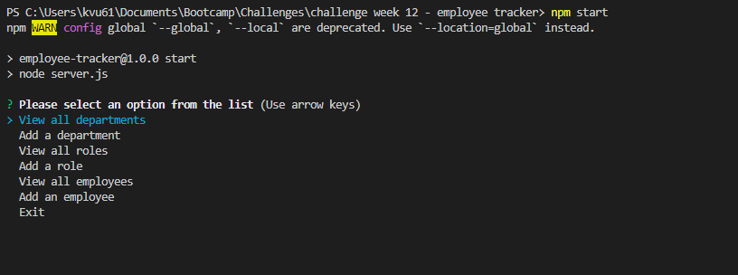

# Employee Tracker
## User Story

```
AS A business owner
I WANT to be able to view and manage the departments, roles, and employees in my company
SO THAT I can organize and plan my business
```

## Acceptance Criteria

```
GIVEN a command-line application that accepts user input
WHEN I start the application
THEN I am presented with the following options: view all departments, view all roles, view all employees, add a department, add a role, add an employee, and update an employee role
WHEN I choose to view all departments
THEN I am presented with a formatted table showing department names and department ids
WHEN I choose to view all roles
THEN I am presented with the job title, role id, the department that role belongs to, and the salary for that role
WHEN I choose to view all employees
THEN I am presented with a formatted table showing employee data, including employee ids, first names, last names, job titles, departments, salaries, and managers that the employees report to
WHEN I choose to add a department
THEN I am prompted to enter the name of the department and that department is added to the database
WHEN I choose to add a role
THEN I am prompted to enter the name, salary, and department for the role and that role is added to the database
WHEN I choose to add an employee
THEN I am prompted to enter the employee’s first name, last name, role, and manager, and that employee is added to the database
WHEN I choose to update an employee role
THEN I am prompted to select an employee to update and their new role and this information is updated in the database
```

## Intructions

```
1. Open terminal in db folder and log into mysql with "mysql -u root -p" and it will prompt user to enter password
2. Once logged in, run source schema.sql to create database
3. Run source seeds.sql while still in db folder terminal
4. Leave db folder and return to root file
5. Run npm install in command line to install dependencies
6. Run npm start in command line to start application
7. User is presented with the command line table asking what actions they would like to perform:
    - "View all departments",
    - "Add a department",
    - "View all roles",
    - "Add a role",
    - "View all employees",
    - "Add an employee",
    - "Exit"
8. When user selects a "view" action they are presented with the information from the corresponding data table
9. When user selects an "add" action they are presented with a series of prompts they can answer to add data to a table
10. When user selects "exit" they will exit command prompt
```

## Photos of pages this project contains
-----


-----
